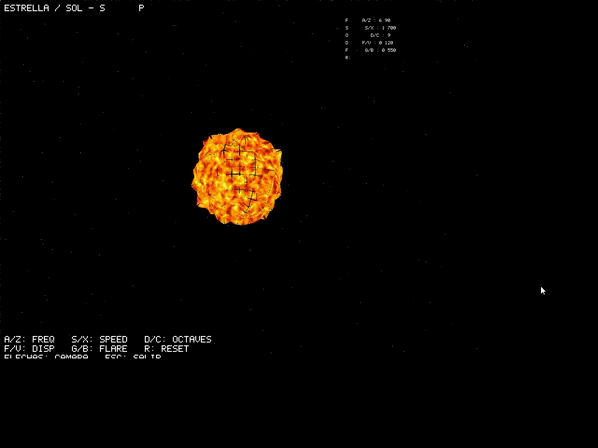

# Star / Sun Shader - Software Rendering

Este proyecto renderiza una **estrella/sol procedimental** usando un sistema de renderizado por software completamente implementado desde cero. La estrella es generada mediante cálculos en shaders personalizados usando **Simplex noise 3D**, manipulando color, emisión variable, y simulando turbulencias y actividad solar en tiempo real.





## 🎯 Objetivo del Proyecto

Diseño de una estrella o "sol" utilizando shaders y funciones de ruido (Simplex noise). La estrella muestra animación con el paso del tiempo, simulando turbulencias, actividad solar y pulsaciones en su superficie.

### Restricciones Técnicas Cumplidas

✅ **Base**: Esfera única (no texturas ni materiales precargados)  
✅ **Animación**: Variable de tiempo (`uniform float time`) + función de ruido Simplex  
✅ **Shaders**: Apariencia y animación modificadas exclusivamente mediante shaders  
✅ **Ciclicidad**: Animación continua y cíclica (se repite con el tiempo)  
✅ **Emisión variable**: Luminosidad y picos de energía simulados  
✅ **Flare visual**: Desplazamiento en Vertex Shader para distorsiones  
✅ **Gradiente dinámico**: Color basado en intensidad/temperatura  
✅ **Parámetros ajustables**: Freq, speed, octaves, displacement, flare en tiempo real

## Requisitos Previos

- **Rust**: Versión 1.70 o superior
- **Cargo**: Gestor de paquetes de Rust (viene incluido con Rust)

Para instalar Rust, visita: https://www.rust-lang.org/tools/install

## Instrucciones de Ejecución

1. **Clonar el repositorio:**
```bash
git clone https://github.com/djuarez-2017510/Lab5Graficas.git
cd Lab5Graficas
```

2. **Compilar y ejecutar el proyecto:**
```bash
cargo run --release
```

> **Nota**: Se recomienda usar `--release` para mejor rendimiento en el renderizado.

3. **Controles:**
- **Teclas A/Z**: Aumentar/disminuir frecuencia espacial del ruido
- **Teclas S/X**: Aumentar/disminuir velocidad temporal de animación
- **Teclas D/C**: Subir/bajar número de octavas (detalle FBM)
- **Teclas F/V**: Aumentar/disminuir desplazamiento de vértices
- **Teclas G/B**: Aumentar/disminuir fuerza de los flares
- **Tecla R**: Resetear todos los parámetros a valores por defecto
- **Flechas**: Rotar cámara y ajustar zoom
- **ESC**: Salir de la aplicación


## Descripción Técnica de la Estrella

La estrella implementada presenta las siguientes características visuales procedurales:

- **Turbulencias procedurales**: Patrones caóticos generados con Simplex noise 3D que simulan plasma y erupciones solares
- **Pulsaciones cíclicas**: Animación continua mediante función sinusoidal basada en tiempo (`sin(time * speed)`)
- **Picos de energía**: Regiones de alta intensidad donde el ruido FBM supera umbral 0.7
- **Flares visuales**: Desplazamiento de vértices en Vertex Shader proporcional a intensidad de ruido
- **Gradiente de temperatura**: Mapeo de emisión a colores realistas:
  - `RGB(255, 140, 40)` → Núcleo naranja cálido (emisión base)
  - `RGB(255, 200, 80)` → Amarillo intenso (emisión media-alta)
  - `RGB(255, 240, 200)` → Amarillo claro (picos moderados)
  - `RGB(255, 250, 240)` → Blanco incandescente (picos máximos)
- **Emisión variable**: Intensidad calculada como `base_emission + noise_fbm * (0.5 + 0.5 * sin(time * speed))`
- **Animación continua**: Sin repeticiones exactas gracias a coordenadas 3D + tiempo en el espacio de ruido

## Implementación Técnica

Este proyecto implementa un **sistema de renderizado por software completo** desde cero, sin usar OpenGL ni otras APIs de gráficos por hardware. La implementación incluye:

### Características Principales

#### Pipeline de Renderizado
- **Vertex Shader**: Transformaciones de vértices (MVP: Model-View-Projection)
- **Fragment Shader**: Cálculos de color y efectos de iluminación por píxel
- **Rasterización**: Conversión de triángulos a píxeles
- **Z-Buffer**: Manejo de profundidad para oclusión correcta

#### Sistema de Shaders
- Múltiples shaders especializados por tipo de planeta
- Generación procedural de texturas
- Efectos de iluminación Phong (difusa + especular)
 - Ruido Simplex para patrones orgánicos

### Arquitectura del Código

```
src/
├── main.rs           # Punto de entrada y loop principal
├── renderer.rs       # Sistema de renderizado y escena
├── rasterizer.rs     # Framebuffer y rasterización de triángulos
├── shaders.rs        # Implementación de todos los shaders
├── sphere.rs         # Carga de modelo OBJ
├── vector.rs         # Matemáticas de vectores 3D
├── matriz.rs         # Transformaciones matriciales
└── text.rs           # Sistema de texto en pantalla
```

### Dependencias

- **tobj**: Carga de archivos OBJ
- **minifb**: Gestión de ventana y visualización
- **nalgebra**: Matemáticas para gráficos 3D

